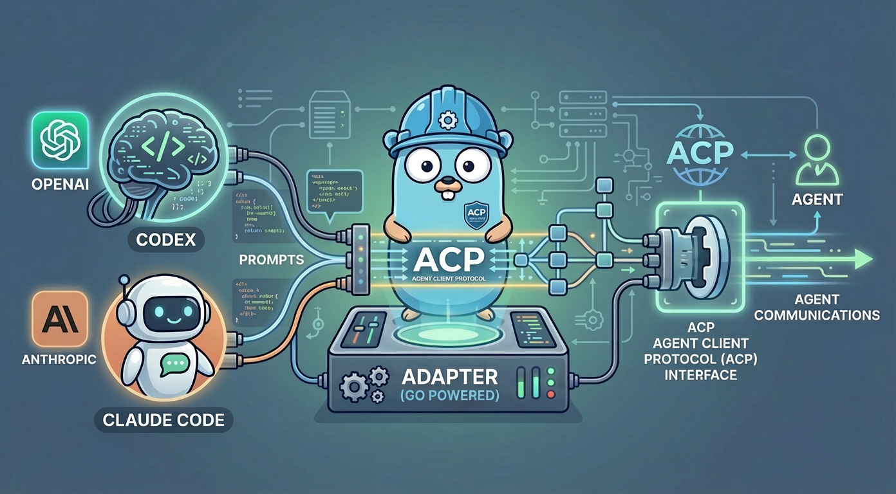

# ACP adapter for Codex & Claude Code

[](https://github.com/beyond5959/acp-adapter/actions)
[](LICENSE)
[](https://go.dev)
[](https://goreportcard.com/report/github.com/beyond5959/acp-adapter)



`acp-adapter` is a Go ACP(Agent Client Protocol) adapter that lets ACP clients drive **Codex** and **Claude Code** over the [ACP protocol](https://agentclientprotocol.com/).

## Usage Modes

This component supports two integration models:

| Mode | Use Case | Entry Point |
|------|----------|-------------|
| **Standalone** (process) | Configure a binary in Zed or other ACP clients | [`cmd/acp`](./cmd/acp) |
| **Library** (embedded) | Host ACP runtime inside your Go service | [`pkg/codexacp`](./pkg/codexacp) [`pkg/claudeacp`](./pkg/claudeacp) |

## Standalone Usage

### Installation

```bash
curl -sSL https://raw.githubusercontent.com/beyond5959/acp-adapter/master/install.sh | sh
```

### Quick Start

```bash
# Codex backend (default)
acp-adapter --adapter codex

# Claude backend
acp-adapter --adapter claude
```

### ACP Client Config

```json
{
  "agent_servers": {
    "acp-adapter": {
      "command": "/usr/local/bin/acp-adapter",
      "args": ["--adapter", "codex"]
    }
  }
}
```

## Library Usage

```go
import "github.com/beyond5959/acp-adapter/pkg/codexacp"

// Stdio mode
cfg := codexacp.DefaultRuntimeConfig()
err := codexacp.RunStdio(ctx, cfg, os.Stdin, os.Stdout, os.Stderr)

// Embedded mode
rt := codexacp.NewEmbeddedRuntime(cfg)
rt.Start(ctx)
defer rt.Close()
resp, err := rt.ClientRequest(ctx, msg)
```

Use `pkg/claudeacp` for Claude backend—the API is identical.

## Codex ACP Support

This section is intentionally based on the current code in [`internal/acp/server.go`](./internal/acp/server.go) and [`internal/acp/types.go`](./internal/acp/types.go).

| ACP surface | Support | Notes |
|------|------|------|
| `initialize` | Yes | Returns `protocolVersion=1` and ACP capability flags. |
| `authenticate` | Yes | Supports `codex_api_key`, `openai_api_key`, `chatgpt_subscription`. |
| `session/new` | Yes | Creates a Codex-backed session/thread. |
| `session/prompt` | Yes | Main turn entry; slash commands are routed here too. |
| `session/cancel` | Yes | Cancels the active Codex turn. |
| `session/list` | Yes | Lists Codex-backed sessions. |
| `session/load` | Yes | Loads a historical Codex session. |
| `session/set_config_option` | Yes | Currently supports `model` and `thought_level`. |
| `session/update` | Yes | Streams prompt execution updates back to the ACP client. |
| `session/request_permission` | Yes | Used for command/file/network/MCP approvals. |
| `fs/read_text_file` | Partial | Used only when the client exposes it, for mentions and diff reconstruction. |
| `fs/write_text_file` | Partial | Used only when `PATCH_APPLY_MODE=acp_fs`. |

| `session/update.type` | Standard `update.sessionUpdate` | Support | Notes |
|------|------|------|------|
| `message` | `agent_message_chunk` / `user_message_chunk` | Yes | Main text streaming path. |
| `tool_call_update` | `tool_call_update` | Yes | Tool lifecycle, approvals, command output, diff, text, and image content. |
| `usage_update` | `usage_update` | Yes | Emitted from Codex `thread/tokenUsage/updated`; currently maps `used=tokenUsage.total.totalTokens` and `size=modelContextWindow`. |
| `config_options_update` | `config_options_update` | Yes | Emitted after `session/set_config_option`. |
| `plan` | `plan` | Yes | Emitted from Codex plan events. |
| `available_commands_update` | `available_commands_update` | Yes | Publishes the Codex slash-command directory. |
| `reasoning` | `agent_thought_chunk` | Yes | Reasoning output is exposed as ACP thought chunks. |
| `status` | no dedicated standard kind | Partial | Present on the wire, but the standard envelope currently falls back to `agent_thought_chunk`. |

| ACP capability flag | Support | Notes |
|------|------|------|
| `loadSession` | Yes | Advertised from `initialize`. |
| `sessionCapabilities.list` | Yes | Advertised when the Codex backend supports session listing. |
| `promptCapabilities.image` | Yes | Advertised. |
| `promptCapabilities.audio` | No | Advertised as unsupported. |
| `promptCapabilities.embeddedContext` | Yes | Advertised. |
| `mcpCapabilities.http` | No | MCP is bridged through Codex command/tool paths, not ACP HTTP transport. |
| `mcpCapabilities.sse` | No | MCP is bridged through Codex command/tool paths, not ACP SSE transport. |
